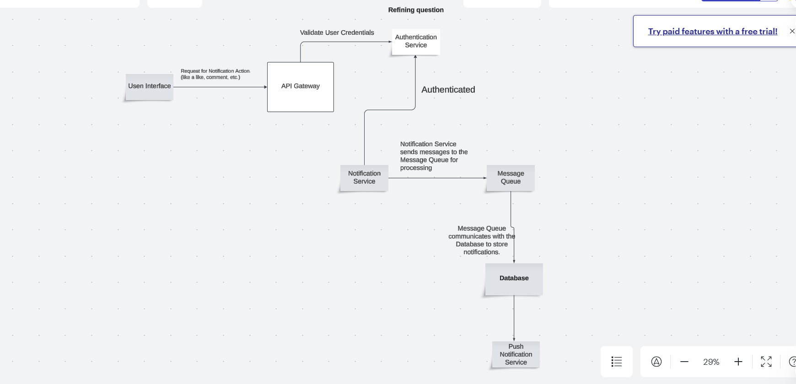

Here’s a detailed breakdown of designing a real-time notification system for a social media platform. I'll cover each deliverable with key considerations, technologies, and system architecture to address the requirements effectively.

---

### 1. System Architecture Diagram



#### Explanation:
1. Clients (Mobile/Web): User applications (mobile or web) that connect to receive notifications in real-time.
2. API Gateway: Handles all API requests and directs them to the correct microservice.
3. Notification Service: Core service responsible for generating notifications and queuing them for delivery.
4. Notification Queue: A message queue (e.g., Kafka, RabbitMQ) to process notifications asynchronously and support high traffic.
5. WebSockets: Real-time delivery channel, used to push notifications instantly.
6. Cache (Redis): Stores notifications for fast retrieval and quick updates.
7. Persistent Storage: Database (e.g., PostgreSQL, MongoDB) for storing notifications permanently for retrieval.

---

### 2. Technology Stack Choices with Justification


### 1. Real-Time Protocol: WebSocket
   - Why WebSocket? WebSocket is ideal for real-time applications because it opens a continuous, two-way communication channel between the client (user's device) and the server. This means that, instead of the client having to repeatedly ask the server for updates (which can be slow and costly), the server can instantly “push” new notifications as soon as they happen.
   - Why Not Use Polling? Polling is when the client repeatedly asks the server if there are any new notifications. This approach uses more bandwidth, adds delay, and increases the server's load, especially when handling millions of users. WebSocket avoids this overhead by keeping a connection open, which is more efficient and offers real-time speed for notifications.

### 2. Backend Framework: Node.js with Express
   - Why Node.js? Node.js is particularly good at handling a large number of simultaneous connections, which is essential for a system that needs to keep users constantly connected to receive instant notifications. Node.js uses non-blocking, asynchronous code, meaning it can perform tasks without waiting for each one to complete before starting the next. This capability is essential in real-time systems where speed is a priority.
   - Why Express? Express is a lightweight framework built on Node.js that simplifies the development of server-side applications. It helps us organize routes, middleware, and other backend functionalities in a clear, manageable way, which is valuable as the project scales.
   - Why Not Python or Ruby on Rails? While Python (with Django or Flask) and Ruby on Rails are popular, they’re more suited to traditional applications with fewer real-time demands. These frameworks use synchronous operations, which can slow down performance under heavy loads. In contrast, Node.js excels in real-time performance due to its non-blocking, event-driven design.

### 3. Message Broker: Kafka or RabbitMQ
   - Why Use a Message Broker? In a high-traffic system, different services need to communicate and share data efficiently without overloading each other. A message broker like Kafka or RabbitMQ can help by letting services exchange messages (such as notifications) in an organized, asynchronous way. This setup allows notifications to be created, queued, and delivered even if some services are temporarily slowed down or experiencing heavy traffic.
   - Kafka vs. RabbitMQ:
      - Kafka is great for high-volume data and can store messages for a longer time, which is beneficial when we need reliability and durability in case of system spikes or failures.
      - RabbitMQ is optimized for faster, low-latency messaging, making it useful when immediate delivery is crucial.
   - Why Not Redis Pub/Sub? Redis is fast but is better suited for quick, in-memory tasks without long-term message storage. It’s not as durable as Kafka or RabbitMQ, meaning that if the Redis server goes down, we could lose important notifications. Kafka and RabbitMQ offer greater reliability for large-scale, distributed applications like this.

### 4. Database: MongoDB (NoSQL)
   - Why NoSQL and MongoDB? A NoSQL database like MongoDB is a good choice because it’s designed to handle high write loads and large volumes of data. Notifications often have different fields (user, message, type, timestamp, etc.), and MongoDB’s flexible schema lets us easily handle this variety without strictly defined tables. Plus, MongoDB can be horizontally scaled by sharding—splitting data across multiple servers to spread out the load.
   - Why Not SQL Databases? Traditional SQL databases, while reliable, are structured in tables and require a fixed schema. This makes it harder to scale and adjust as notification types or data needs evolve. NoSQL databases like MongoDB allow for more flexibility and easier scaling, which is critical for handling millions of notifications quickly and efficiently.

### 5. Cache: Redis
   - Why Redis? Redis is an in-memory data store, which means it can read and write data extremely quickly. This is particularly useful for caching the most frequently accessed data, such as unread notifications. By storing frequently needed data in Redis, we avoid repeatedly querying the database, which speeds up performance and reduces the load on our main database.
   - Why Not Memcached? Memcached is another caching tool that’s very fast, but Redis has additional features that make it more powerful for this use case. Redis supports complex data structures (like sets, sorted sets, and hashes), which we can use to store notifications with additional metadata. Redis also supports persistence (it can save data to disk), whereas Memcached is purely in-memory, meaning data would be lost if the server restarts.

### 6. Push Notifications: Firebase Cloud Messaging (FCM) / Apple Push Notification Service (APNS)
   - Why Use Push Notification Services? For offline support, we need a way to notify users even if they’re not currently using the app or have it closed. Services like FCM (for Android and web) and APNS (for iOS) allow us to send notifications to users’ devices directly, making sure they stay informed even when they’re not actively connected.
   - Why Not WebSocket Alone? WebSocket is excellent for real-time notifications but only works when the app is open or actively connected to the internet. Push notification services ensure users don’t miss notifications, even if they’re offline or the app is closed. Combining both WebSocket (for online users) and FCM/APNS (for offline users) gives full coverage for delivering notifications.

### 7. Monitoring: Prometheus + Grafana
   - Why Use Monitoring Tools? In a high-traffic system like this, monitoring is crucial for keeping track of performance, detecting any delays or issues, and optimizing the system. Prometheus can gather metrics such as the number of active connections, delivery speed, server load, and error rates. Grafana then visualizes these metrics, providing easy-to-read dashboards that help us identify any performance issues in real-time.
   - Why Not Just Basic Logging? While logging can provide basic information about errors, it doesn’t offer the same level of detail or real-time alerting. With Prometheus and Grafana, we can set up alerts for specific metrics, such as if server response time goes above a certain threshold, and track performance over time. This way, we’re proactive in maintaining the health and responsiveness of the notification system.

### 3. Database Schema:

#### 1. Notifications Collection

   - Purpose: This collection holds individual notifications, with information about the type (e.g., like, mention, comment), content, and read status. Each document here is self-contained, making it easy to access, modify, or delete specific notifications.
   
   - Schema Design:
     ```json
     {
         "_id": "ObjectId",              // Unique ID for the notification
         "userId": "String",              // ID of the user receiving the notification
         "type": "String",                // Notification type (e.g., "mention", "like", "comment")
         "entityId": "String",            // ID of the associated post/comment
         "message": "String",             // Content of the notification (e.g., "User123 liked your post")
         "isRead": "Boolean",             // Flag to indicate if the notification has been read
         "createdAt": "Timestamp",        // Timestamp when notification was created
         "updatedAt": "Timestamp"         // Timestamp of any updates
     }
     ```
     - Indexes:
       - `userId` + `isRead`: To efficiently retrieve unread notifications for a specific user.
       - `createdAt`: To quickly access recent notifications.

   - Example Document:
     ```json
     {
         "_id": "64a02db3f3a1b2d34c6e2a1f",
         "userId": "abc123",
         "type": "like",
         "entityId": "post456",
         "message": "User789 liked your post.",
         "isRead": false,
         "createdAt": "2024-11-05T12:34:56Z",
         "updatedAt": "2024-11-05T12:34:56Z"
     }
     ```

---

#### 2. UserPreferences Collection

   - Purpose: This collection stores each user’s preferences regarding which types of notifications they want to receive. It allows us to tailor notifications according to each user’s preferences, enhancing the user experience.

   - Schema Design:
     ```json
     {
         "_id": "String",                  // Unique user ID
         "preferences": {                  // Notification preferences
             "mention": "Boolean",         // Receive mention notifications
             "like": "Boolean",            // Receive like notifications
             "comment": "Boolean",         // Receive comment notifications
             "emailNotifications": "Boolean" // Enable email notifications
         },
         "createdAt": "Timestamp",         // Creation timestamp
         "updatedAt": "Timestamp"          // Last updated timestamp
     }
     ```

   - Indexes:
     - `_id`: The user ID serves as the primary key, allowing fast lookups.

   - Example Document:
     ```json
     {
         "_id": "abc123",
         "preferences": {
             "mention": true,
             "like": false,
             "comment": true,
             "emailNotifications": true
         },
         "createdAt": "2024-11-01T08:30:00Z",
         "updatedAt": "2024-11-05T09:15:22Z"
     }
     ```

---

#### 3. UserActivity Collection (Optional)

   - Purpose: This collection logs each user’s actions on notifications. For instance, if a user reads or dismisses a notification, we can track that here. It’s useful for analyzing user engagement and refining notification strategies.

   - Schema Design:
     ```json
     {
         "_id": "ObjectId",               // Unique ID for each activity
         "userId": "String",              // User who performed the action
         "notificationId": "String",      // ID of the associated notification
         "action": "String",              // Action taken (e.g., "read", "dismissed", "clicked")
         "actionTimestamp": "Timestamp"   // When the action was performed
     }
     ```

   - Indexes:
     - `userId` + `notificationId`: For quick lookups on user activity history.

   - Example Document:
     ```json
     {
         "_id": "62c7fabc3f4a12c53b8e4e8d",
         "userId": "abc123",
         "notificationId": "64a02db3f3a1b2d34c6e2a1f",
         "action": "read",
         "actionTimestamp": "2024-11-05T12:40:00Z"
     }
     ```

---

### Summary of Design Choices

- Notifications Collection: Supports individual storage of notifications, optimizing for fast retrieval and update.
- UserPreferences Collection: Tailors the notification experience to user preferences, enhancing user satisfaction and engagement.
- UserActivity Collection (Optional): Tracks engagement with notifications, providing insights to improve the system and personalize future notifications.

Each collection is designed to balance speed, scalability, and flexibility, making it well-suited to the high-traffic and real-time nature of a social media notification system.

### 4. API Endpoints:


### 1. Create Notification
   - Purpose: To generate a new notification when an event occurs (like a mention, like, or comment).
   - Endpoint: `POST /api/notifications`
   - Request Body:
     ```json
     {
         "userId": "String",         // ID of the user receiving the notification
         "type": "String",           // Type of notification (e.g., "mention", "like", "comment")
         "entityId": "String",       // ID of the post/comment triggering the notification
         "message": "String"         // Notification message content
     }
     ```
   - Response:
     ```json
     {
         "status": "success",
         "notificationId": "String", // ID of the created notification
         "createdAt": "Timestamp"
     }
     ```
   - Description: This endpoint is used internally by the backend whenever an event triggers a notification. The backend service will call this endpoint to create a new notification document in the database.

---

### 2. Get Notifications for User
   - Purpose: To retrieve a user’s notifications, optionally filtering by read/unread status.
   - Endpoint: `GET /api/users/{userId}/notifications`
   - Query Parameters:
     - `isRead` (optional): Boolean to filter by read/unread notifications.
     - `limit` (optional): Number of notifications to retrieve per page.
     - `page` (optional): Page number for pagination.
   - Response:
     ```json
     {
         "status": "success",
         "data": [
             {
                 "notificationId": "String",
                 "type": "String",
                 "message": "String",
                 "entityId": "String",
                 "isRead": "Boolean",
                 "createdAt": "Timestamp"
             }
         ],
         "total": "Integer",      // Total number of notifications
         "page": "Integer",       // Current page number
         "pages": "Integer"       // Total pages
     }
     ```
   - Description: This endpoint returns a paginated list of notifications for a user. It allows clients to filter notifications by read status, making it easier for users to manage unread notifications.

---

### 3. Mark Notification as Read
   - Purpose: To update a notification’s status to “read.”
   - Endpoint: `PUT /api/notifications/{notificationId}/read`
   - Response:
     ```json
     {
         "status": "success",
         "message": "Notification marked as read."
     }
     ```
   - Description: This endpoint is used when a user views a notification. It updates the `isRead` field to `true` in the Notifications collection, ensuring that only unread notifications are highlighted.

---

### 4. Mark All Notifications as Read for a User
   - Purpose: To mark all notifications as read for a user.
   - Endpoint: `PUT /api/users/{userId}/notifications/read`
   - Response:
     ```json
     {
         "status": "success",
         "message": "All notifications marked as read."
     }
     ```
   - Description: This endpoint provides an option to mark all notifications as read in a single request, improving the user experience by allowing bulk actions.

---

### 5. Update User Notification Preferences
   - Purpose: To update a user’s notification preferences.
   - Endpoint: `PUT /api/users/{userId}/preferences`
   - Request Body:
     ```json
     {
         "preferences": {
             "mention": "Boolean",
             "like": "Boolean",
             "comment": "Boolean",
             "emailNotifications": "Boolean"
         }
     }
     ```
   - Response:
     ```json
     {
         "status": "success",
         "message": "Preferences updated successfully."
     }
     ```
   - Description: This endpoint allows users to adjust their notification settings, including the types of notifications they want to receive. This helps reduce unnecessary notifications and ensures the user only receives relevant updates.

---

### 6. Track Notification Action
   - Purpose: To log a user’s action on a notification (e.g., read, dismissed, or clicked).
   - Endpoint: `POST /api/notifications/{notificationId}/action`
   - Request Body:
     ```json
     {
         "action": "String"             // Action taken, e.g., "read", "dismissed", "clicked"
     }
     ```
   - Response:
     ```json
     {
         "status": "success",
         "message": "Action recorded successfully."
     }
     ```
   - Description: This endpoint is optional and used to track user engagement with notifications, storing the action in the UserActivity collection. Insights from this data can help optimize notification strategies by analyzing how users interact with different types of notifications.

---

### 7. Send Push Notification (For Offline Users)
   - Purpose: To trigger a push notification for a user who is offline or has notifications enabled on their device.
   - Endpoint: `POST /api/users/{userId}/send-push`
   - Request Body:
     ```json
     {
         "notificationId": "String",  // ID of the notification to send
         "message": "String"          // The message to send as a push notification
     }
     ```
   - Response:
     ```json
     {
         "status": "success",
         "message": "Push notification sent."
     }
     ```
   - Description: This endpoint is integrated with a push notification service (like Firebase Cloud Messaging or Apple Push Notification Service) to send notifications directly to the user’s device. This is particularly important for users who are not actively connected but have enabled push notifications.

---

### Summary of API Endpoints

- The API endpoints cover creating, retrieving, updating, and tracking notifications, and managing user preferences. 
- These endpoints provide a comprehensive set of actions to ensure users receive real-time updates, with offline support and flexibility to customize notifications based on their preferences.


### 5. Scaling considerations

1. Database Sharding and Replication – Sharding by user or region helps distribute load, and replication ensures high availability.
   
2. Message Queue – Using a message queue (like Kafka) allows us to handle high-throughput notifications asynchronously, reducing bottlenecks.

3. WebSocket Connections – Real-time delivery requires WebSockets with proper load balancing and connection management to handle millions of concurrent users.

4. Caching Layer – Caching with Redis or Memcached improves performance for frequently accessed data like unread notifications, minimizing database strain.

5. Monitoring and Auto-Scaling – Monitoring tools with auto-scaling policies allow us to dynamically handle traffic surges, ensuring reliable performance.


### 6. Security Measures:
Candidate: "For a notification system handling sensitive user data, security is paramount. Here’s how I would secure the system to protect user data and maintain trust:


1. Authentication and Authorization
   - Implement OAuth 2.0 for secure user authentication.
   

2. API Rate Limiting and Throttling
   - Rate limiting to control the number of requests a user can make within a time frame, preventing abuse and denial-of-service attacks.
   - Throttling to slow down clients exceeding their request limits, ensuring fair usage and protecting against traffic spikes.

